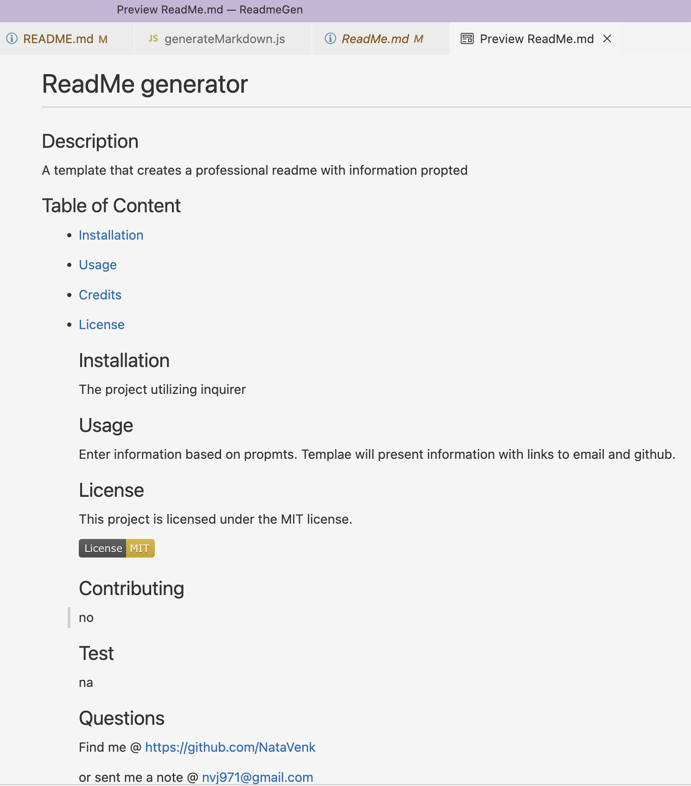

# ReadmeGen

ReadMe Generator

## Goal

Create a template that will generate ReadMe based on information entered

## Acceptance Criteria

When i start creating Readme I presented with set of questions. Once I enter the answers, the tempale is created showing the Title, Table of Content, Installation, Usage, License, Contributing and Test sections. 
The License badge must be proptly shown. In last section "questions" , my github and my email must be creaetd as links. When i click on Table of content it must take me to appropriate section.

## Mock-up

   

## Credits

class instructor
Sean New

## License

MIT license

